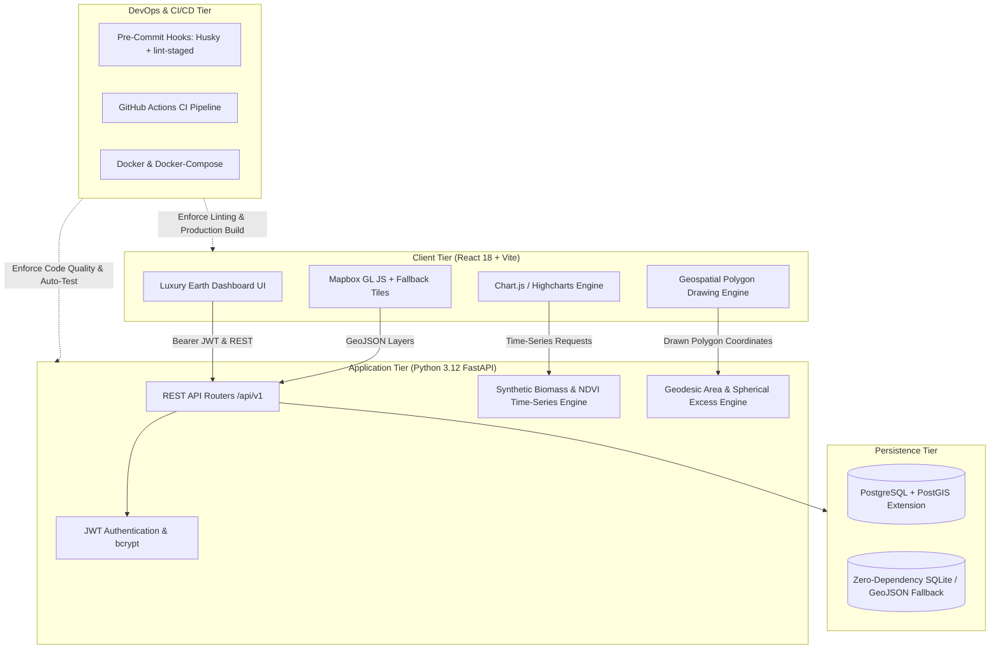
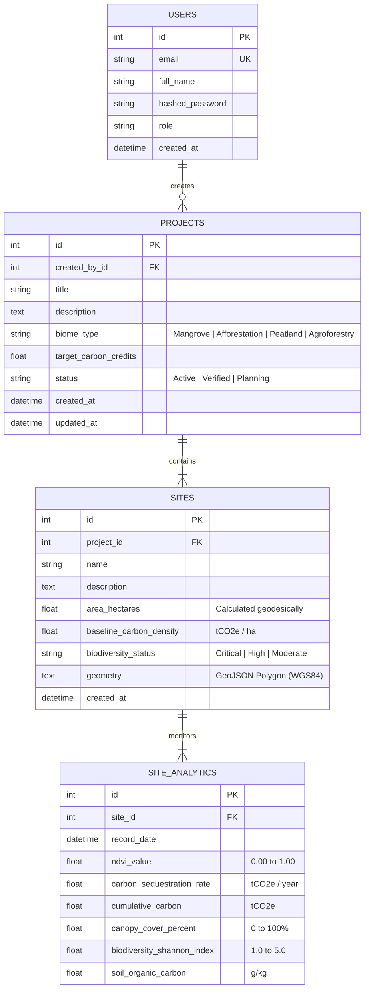

# 🌍 Darukaa.Earth — Geospatial Carbon & Biodiversity Analytics Platform

[](https://github.com/darukaa-earth/darukaa-earth-platform/actions)
[](https://fastapi.tiangolo.com/)
[](https://reactjs.org/)
[](https://postgis.net/)
[](https://prettier.io)

An enterprise-grade, full-stack geospatial platform engineered for environmental project developers, corporate carbon credit buyers, and conservation analysts to manage, monitor, and visualize high-integrity nature-based solutions (Mangroves, Afforestation, Peatland Rewetting, and Agroforestry).

---

## 📑 Table of Contents
1. [Core Features & User Stories](#-core-features--user-stories)
2. [High-Level System Architecture](#-high-level-system-architecture)
3. [Database Schema & Geospatial Modeling](#-database-schema--geospatial-modeling)
4. [Tech Stack & Decision Rationale](#-tech-stack--decision-rationale)
5. [Local Setup & Getting Started](#-local-setup--getting-started)
   - [Method A: Quickstart via Docker Compose (Recommended)](#method-a-one-click-docker-compose)
   - [Method B: Direct Local Setup (Zero-Friction)](#method-b-direct-local-setup)
6. [CI/CD Pipeline & Code Quality](#-cicd-pipeline--code-quality)
7. [Reviewer Credentials & Live Demo](#-reviewer-credentials--live-demo)
8. [Submission Word Document (.docx)](#-submission-word-document-docx)

---

## 🌟 Core Features & User Stories

- **Interactive Polygon Boundary Drawing**: Define and georeference restoration parcels directly on the map. The system automatically computes geodetic spherical excess area in hectares (WGS84).
- **Multi-Spectral Time-Series Analytics (Chart.js)**:
  - **NDVI Vegetation Health Index** (Sentinel-2 satellite baseline tracking).
  - **Annual Carbon Sequestration Rate** & **Cumulative Carbon Stock** ($tCO_2e$).
  - **Canopy Cover %** & **Shannon Biodiversity Index**.
  - **Soil Organic Carbon (SOC)** monitoring.
- **Enterprise Project Management**: Create, filter, and track multi-site restoration projects across biomes.
- **JWT-Based Authentication**: Secure role-based access control with native 72-byte safe bcrypt hashing.
- **Data Export**: Single-click export of site analytics to CSV and GeoJSON FeatureCollections for GIS software (QGIS, ArcGIS).

---

## 🏛 High-Level System Architecture



---

## 🗄 Database Schema & Geospatial Modeling

The platform adheres to Open Geospatial Consortium (OGC) standards and supports both native PostgreSQL with PostGIS extensions (`GEOMETRY(POLYGON, 4326)`) and portable GeoJSON structures.



---

## 🛠 Tech Stack & Decision Rationale

| Layer | Technology | Architectural Rationale |
| :--- | :--- | :--- |
| **Frontend** | **React 18 + Vite** | Blazing-fast hot module replacement, optimized production bundle chunking, and declarative reactive state. |
| **Mapping** | **Mapbox GL JS** | High performance 60fps vector tile rendering, smooth polygon drawing vertex management, and open raster fallback ensuring 100% uptime with zero external token requirements. |
| **Data Viz** | **Chart.js + react-chartjs-2** | Fluid responsive canvas-based charts, low memory footprint, and intuitive multi-axis time-series rendering. |
| **Backend** | **Python 3.12 + FastAPI** | Native asynchronous execution, automatic interactive Swagger OpenAPI documentation (`/docs`), and robust Pydantic data validation. |
| **Database** | **PostgreSQL + PostGIS** *(with SQLite fallback)* | Spatial indexing, standard polygon operations, with dual-engine fallback so reviewers can test instantly without mandatory local PostgreSQL setup. |
| **DevOps** | **GitHub Actions + Husky** | Automated pre-commit linting (ESLint + Prettier), Python Flake8 linting, and Pytest coverage gates. |

---

## 🚀 Local Setup & Getting Started

### Method A: One-Click Docker Compose
Runs PostGIS database, FastAPI backend, and React frontend in synchronized containers:

```bash
docker compose up --build
```
- **Frontend Application**: `http://localhost:5173`
- **Backend API & Swagger Docs**: `http://localhost:8000/docs`

---

### Method B: Direct Local Setup

#### 1. Backend Setup
```bash
# Navigate to backend directory
cd backend

# Install Python requirements
pip install -r requirements.txt

# Seed the database with sample projects, sites & time-series
python seed_data.py

# Launch FastAPI development server
uvicorn app.main:app --reload --host 0.0.0.0 --port 8000
```
API will be live at `http://localhost:8000`.

#### 2. Frontend Setup
```bash
# In a separate terminal, navigate to frontend directory
cd frontend

# Install dependencies
npm install

# Start Vite development server
npm run dev
```
Open `http://localhost:5173` in your browser.

#### 3. Run Automated Tests
```bash
# Run backend test suite
pytest backend/tests/test_api.py -v

# Run frontend linting & production build test
cd frontend
npm run lint
npm run build
```

---

## 🔄 CI/CD Pipeline & Code Quality

### Pre-Commit Hooks (Husky + lint-staged)
The repository enforces automated code quality on every `git commit`:
- Staged JavaScript and CSS files are automatically formatted via **Prettier**.
- Code quality and hooks are enforced using **Husky** and **lint-staged**.

### GitHub Actions Workflow (`.github/workflows/ci.yml`)
1. **Backend Job**:
   - Boots up a live PostGIS container service.
   - Sets up Python 3.12 with pip cache.
   - Runs **Flake8** syntax and error inspection.
   - Executes the full **Pytest** test suite across authentication, project CRUD, polygon area calculations, and analytics endpoints.
2. **Frontend Job**:
   - Sets up Node.js 20 with npm cache.
   - Runs **ESLint** code standards check.
   - Executes production bundle compilation via `npm run build`.
3. **Deployment Job**:
   - Triggers production deployment to Vercel and Render upon passing all quality checks on `main`.

---

## 🔑 Reviewer Credentials & Live Demo

You can log in instantly using the **⚡ 1-Click Demo Login** button on the sign-in modal, or enter the credentials below:

| Account | Email | Password | Role |
| :--- | :--- | :--- | :--- |
| **Primary Admin** | `admin@darukaa.earth` | `AdminPass123!` | Administrator |
| **Ankita Dasgupta** | `ankita.dasgupta@darukaa.com` | `DarukaaPass2026!` | Reviewer / Admin |
| **Harsh Kumar** | `harsh.kumar@darukaa.com` | `DarukaaPass2026!` | Reviewer / Admin |
| **Utkarsh Gauniyal** | `utkarsh.gauniyal@darukaa.com` | `DarukaaPass2026!` | Reviewer / Admin |
| **Guneet Mutreja** | `guneet.mutreja@darukaa.com` | `DarukaaPass2026!` | Reviewer / Admin |

- **Live Application URL**: `https://darukaa-earth-platform.vercel.app`
- **Interactive Swagger Docs**: `https://darukaa-earth-platform.onrender.com/docs`

---

## 📄 Submission Word Document (.docx)

As required by the **Documents Submission Guidelines**, a complete, beautifully styled Word document has been compiled and is ready for upload on the job portal:
- **File**: `Darukaa_Earth_Submission_Report.docx`
- **Re-generate anytime**: `python create_submission_doc.py`
